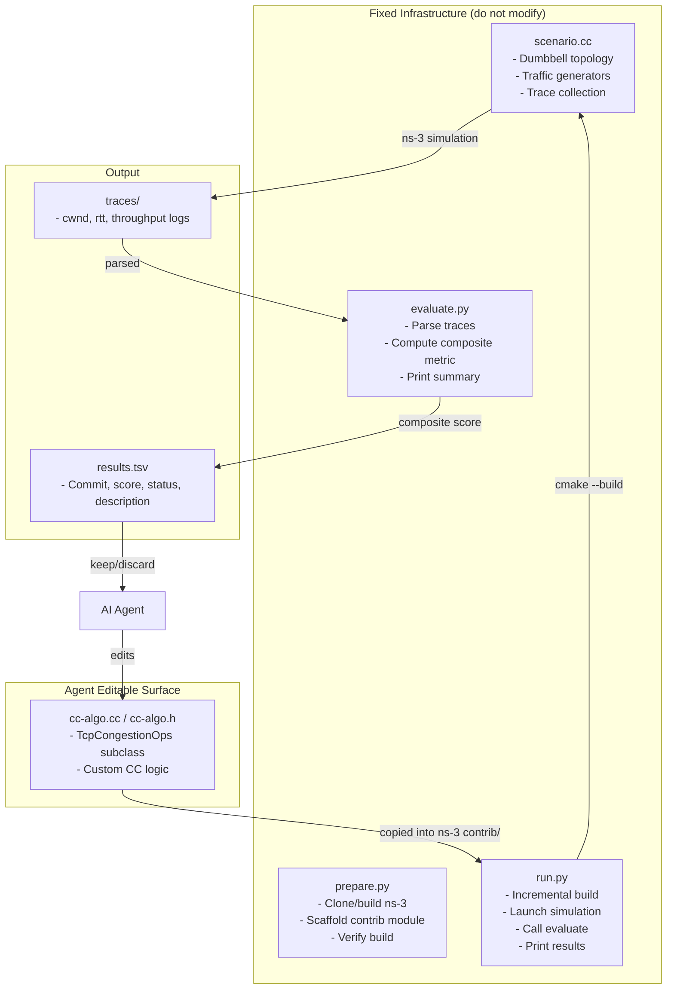

# Restructure nar as a Multi-Topic Network Auto Research Project

## Problem

- `nar/` was the old LLM autoresearch repo with `net-autoresearch/` nested inside it.
- Root-level files like `train.py`, `analysis.ipynb`, `progress.png`, and old `program.md` were unrelated to network research.
- The ns-3 dependency was not first-class at repo root.
- Congestion control worked, but there was no clean contract for adding topology/protocol topics.

## Target Layout

```
nar/
├── README.md
├── PLAN.md
├── pyproject.toml                     # name = "nar"
├── .python-version
├── .gitignore
├── .gitmodules
│
├── third_party/
│   └── ns-3-dev/                      # git submodule pinned to ns-3.42
│
├── lib/
│   ├── __init__.py
│   └── ns3.py                         # shared toolchain/build helpers
│
├── topics/
│   └── cc/
│       ├── README.md
│       ├── program.md
│       ├── prepare.py
│       ├── run.py
│       ├── evaluate.py
│       ├── src/
│       │   ├── cc-algo.h
│       │   └── cc-algo.cc
│       └── infra/
│           ├── scenario.cc
│           ├── module-scaffold/CMakeLists.txt
│           └── baselines/cubic_baseline.json
│
├── artifacts/
│   └── cc/
│       ├── traces/
│       └── results.tsv
│
└── .cursor/
    └── rules/
        └── storage-policy.mdc
```

## ns-3 Submodule Version Locking

- Track ns-3 as git submodule at `third_party/ns-3-dev`.
- Pin to `ns-3.42` commit `ab4cce021d8f6b2458784704a10af810d3969f0f`.
- Parent repo stores the exact submodule SHA for reproducibility.

## Topic Contract (for expansion)

Every topic should follow:

```
topics/<name>/
├── program.md
├── prepare.py
├── run.py
├── evaluate.py
├── src/      # editable C++ surface
└── infra/    # fixed scenario + baselines
```

Runtime output should go to:

```
artifacts/<name>/
```

This supports congestion control now, and future topology/protocol research topics without changing shared infrastructure.

## Change Set

1. Delete unrelated LLM/nanochat artifacts from root.
2. Move ns-3 submodule to `third_party/ns-3-dev` and pin version.
3. Move `net-autoresearch` content into `topics/cc`.
4. Add shared helper module `lib/ns3.py`.
5. Refactor `topics/cc` scripts to use shared helpers and new artifact paths.
6. Rewrite root docs/config (`README.md`, `pyproject.toml`, `.gitignore`, `.cursor/rules/storage-policy.mdc`).
7. Update `topics/cc/program.md`.
8. Add `topics/cc/README.md`.
# Network Auto Researcher -- Implementation Plan

## Concept

Mirror the [autoresearch](./README.md) design -- one editable file, fixed evaluation harness, fixed simulation budget, keep/discard loop -- but applied to **congestion control research** using **ns-3**. The agent iterates on a custom `TcpCongestionOps` C++ implementation, rebuilds incrementally, runs a fixed set of evaluation scenarios, and optimizes a composite networking metric.



---

## 1. Project Skeleton

New standalone project at a sibling directory (e.g. `D:\data\net-autoresearch\`).

```
net-autoresearch/
├── README.md                  # Project overview and quick-start
├── pyproject.toml             # Python deps (orchestration, trace parsing, analysis)
├── .python-version            # 3.10
├── .gitignore
│
├── program.md                 # Agent protocol (autonomous experiment loop)
├── prepare.py                 # One-time: clone ns-3, scaffold module, initial build
├── run.py                     # Per-experiment: build, simulate, evaluate, print summary
├── evaluate.py                # Parse ns-3 traces, compute composite metric
├── analysis.ipynb             # Results analysis notebook
│
├── src/                       # ---- THE EDITABLE SURFACE ----
│   ├── cc-algo.h              # Header: TcpAutoCC class declaration
│   └── cc-algo.cc             # Implementation: the ONE file the agent modifies
│
├── infra/                     # ---- FIXED (do not modify) ----
│   ├── scenario.cc            # Dumbbell topology + traffic + trace setup
│   ├── module-scaffold/       # CMakeLists.txt template for the ns-3 contrib module
│   │   └── CMakeLists.txt
│   └── baselines/             # Cached Cubic baseline results for normalization
│       └── cubic_baseline.json
│
└── results.tsv                # Experiment ledger (gitignored)
```

`pyproject.toml`:

```toml
[project]
name = "net-autoresearch"
version = "0.1.0"
description = "Autonomous congestion control research via ns-3"
requires-python = ">=3.10"
dependencies = [
    "pandas>=2.3",
    "numpy>=2.2",
    "matplotlib>=3.10",
]
```

ns-3 is built from source (C++/cmake) and is **not** a Python package dependency.

---

## 2. `prepare.py` -- One-Time Setup

Responsibilities:

1. **Clone ns-3** (pin to `ns-3.42`) into `~/.cache/net-autoresearch/ns3/`.
2. **Configure** with cmake: enable examples, disable tests (faster build).
3. **Scaffold contrib module** `auto-cc` under `contrib/auto-cc/`:
   - Copy `infra/module-scaffold/CMakeLists.txt` into the module root.
   - Copy `src/cc-algo.h` and `src/cc-algo.cc` into `model/`.
   - Copy `infra/scenario.cc` into `examples/`.
4. **Full initial build** to warm the cmake cache and compile all dependencies.
5. **Run Cubic baseline** across all three evaluation scenarios; cache results to `infra/baselines/cubic_baseline.json` for metric normalization.
6. **Verify** the scenario binary exists and produces valid trace output.

Cache layout:

```
~/.cache/net-autoresearch/
├── ns3/                  # ns-3 source tree + cmake build artifacts
└── traces/               # Per-run simulation trace CSVs (cleaned between runs)
```

---

## 3. `src/cc-algo.cc` -- The Editable Surface

A single C++ file implementing a custom `TcpCongestionOps` subclass. This is the **only file the agent modifies** (equivalent to `train.py` in autoresearch).

### `src/cc-algo.h`

```cpp
#ifndef TCP_AUTO_CC_H
#define TCP_AUTO_CC_H

#include "ns3/tcp-congestion-ops.h"

namespace ns3 {

class TcpAutoCC : public TcpCongestionOps {
public:
    static TypeId GetTypeId();
    TcpAutoCC();
    std::string GetName() const override;
    uint32_t GetSsThresh(Ptr<const TcpSocketState> tcb,
                          uint32_t bytesInFlight) override;
    void IncreaseWindow(Ptr<TcpSocketState> tcb,
                         uint32_t segmentsAcked) override;
    Ptr<TcpCongestionOps> Fork() override;
};

} // namespace ns3
#endif
```

### `src/cc-algo.cc` (baseline: NewReno-like)

```cpp
#include "cc-algo.h"
#include "ns3/tcp-socket-state.h"
#include "ns3/log.h"
#include <algorithm>

namespace ns3 {

NS_LOG_COMPONENT_DEFINE("TcpAutoCC");
NS_OBJECT_ENSURE_REGISTERED(TcpAutoCC);

TypeId TcpAutoCC::GetTypeId() {
    static TypeId tid = TypeId("ns3::TcpAutoCC")
        .SetParent<TcpCongestionOps>()
        .SetGroupName("Internet")
        .AddConstructor<TcpAutoCC>();
    return tid;
}

TcpAutoCC::TcpAutoCC() : TcpCongestionOps() {}

std::string TcpAutoCC::GetName() const { return "TcpAutoCC"; }

uint32_t TcpAutoCC::GetSsThresh(Ptr<const TcpSocketState> tcb,
                                  uint32_t bytesInFlight) {
    return std::max(2 * tcb->m_segmentSize, bytesInFlight / 2);
}

void TcpAutoCC::IncreaseWindow(Ptr<TcpSocketState> tcb,
                                uint32_t segmentsAcked) {
    if (tcb->m_cWnd < tcb->m_ssThresh) {
        // Slow start: increase cwnd by one segment per ACK
        tcb->m_cWnd += tcb->m_segmentSize;
    } else {
        // Congestion avoidance: increase cwnd by ~1 segment per RTT
        double adder = static_cast<double>(tcb->m_segmentSize *
                       tcb->m_segmentSize) / tcb->m_cWnd.Get();
        tcb->m_cWnd += std::max(1.0, adder);
    }
}

Ptr<TcpCongestionOps> TcpAutoCC::Fork() {
    return CopyObject<TcpAutoCC>(this);
}

} // namespace ns3
```

The agent is free to change everything inside this file: window increase logic, add RTT-based signals, implement delay-gradient detection, add pacing, override additional virtual methods (`CongControl`, `CongestionStateSet`, `PktsAcked`, etc.).

---

## 4. `infra/scenario.cc` -- Fixed Evaluation Scenario

Dumbbell topology with fixed parameters:

```
  Sender_0 ──┐                                  ┌── Receiver_0
  Sender_1 ──┤── [Router_A] ════ [Router_B] ──┤── Receiver_1
  Sender_2 ──┘   bottleneck: 10 Mbps, 10ms     └── Receiver_2
                  queue: DropTail, 1.5x BDP
  access links: 100 Mbps, 1ms each
```

Three evaluation sub-scenarios run sequentially in a single invocation:

- **Scenario A -- Single flow** (60s simulated time):
  1 BulkSend flow from Sender_0 to Receiver_0.
  Measures: throughput (goodput), average RTT, p99 RTT.

- **Scenario B -- Multi-flow fairness** (60s simulated time):
  5 BulkSend flows, staggered start (0s, 5s, 10s, 15s, 20s).
  Measures: per-flow throughput, Jain's fairness index.

- **Scenario C -- Dynamic bandwidth** (60s simulated time):
  1 BulkSend flow. Bottleneck bandwidth halves at t=30s, restores at t=45s.
  Measures: throughput recovery time (adaptation speed).

Trace outputs per scenario: per-flow `cwnd`, `rtt`, `throughput` sampled at 100ms intervals, written to CSVs in `~/.cache/net-autoresearch/traces/`.

---

## 5. `infra/module-scaffold/CMakeLists.txt`

```cmake
build_lib(
    LIBNAME auto-cc
    SOURCE_FILES
        model/cc-algo.cc
    HEADER_FILES
        model/cc-algo.h
    LIBRARIES_TO_LINK
        ${libinternet}
        ${libpoint-to-point}
        ${libapplications}
        ${libtraffic-control}
)

build_lib_example(
    NAME auto-cc-scenario
    SOURCE_FILES examples/scenario.cc
    LIBRARIES_TO_LINK
        ${libauto-cc}
        ${libinternet}
        ${libpoint-to-point}
        ${libapplications}
        ${libtraffic-control}
)
```

---

## 6. `evaluate.py` -- Metric Computation

Parses trace CSVs from `~/.cache/net-autoresearch/traces/` and computes a **composite score** (higher is better):

```
score = w_t * norm_throughput  +  w_d * (1 - norm_delay)  +  w_f * fairness  +  w_a * adaptation
```

| Weight | Component          | Source           | Definition                                              |
|--------|--------------------|------------------|---------------------------------------------------------|
| 0.30   | `norm_throughput`  | Scenario A       | `throughput / cubic_throughput` (capped at 2.0)         |
| 0.30   | `norm_delay`       | Scenario A       | `avg_rtt / cubic_avg_rtt` (capped at 2.0)              |
| 0.20   | `fairness`         | Scenario B       | Jain's fairness index (0 to 1)                          |
| 0.20   | `adaptation`       | Scenario C       | `1 - clamp(recovery_time / 10s, 0, 1)` (fast = better) |

Normalization baseline: Cubic results cached during `prepare.py`.

A score of `1.0` means Cubic-equivalent. `>1.0` means better than Cubic.

Prints a machine-readable summary block:

```
---
score:            1.0342
throughput_mbps:  9.21
avg_rtt_ms:       22.4
p99_rtt_ms:       45.1
fairness_index:   0.964
adaptation_s:     2.1
build_seconds:    8.2
sim_seconds:      31.5
total_seconds:    42.3
---
```

---

## 7. `run.py` -- Per-Experiment Orchestrator

Called as `uv run run.py`. Steps:

1. **Copy** `src/cc-algo.cc` and `src/cc-algo.h` into `~/.cache/net-autoresearch/ns3/contrib/auto-cc/model/`.
2. **Incremental cmake build** (typically <15s for single-file changes). If build fails, print compiler errors and `exit(1)`.
3. **Run** the scenario binary (all three sub-scenarios sequentially).
4. **Call** `evaluate.py` to parse traces and compute the composite score.
5. **Print** the summary block.
6. **Clean up** trace files.

Wall-clock budget: **3 minutes** total. If exceeded, kill the simulation subprocess and treat as failure.

---

## 8. `program.md` -- Agent Protocol

Same keep/discard loop as autoresearch, adapted for CC research:

### Setup phase
1. Agree on a run tag (e.g. `mar12`).
2. Create branch `net-autoresearch/<tag>` from master.
3. Read `src/cc-algo.cc`, `infra/scenario.cc`, and `evaluate.py` for full context.
4. Verify `~/.cache/net-autoresearch/` has a built ns-3. If not, tell human to run `uv run prepare.py`.
5. Initialize `results.tsv` with header.
6. Run baseline (unmodified `cc-algo.cc`) and record result.

### Experiment loop (runs indefinitely)
1. Edit `src/cc-algo.cc` (and optionally `src/cc-algo.h`).
2. `git commit`.
3. `uv run run.py > run.log 2>&1`.
4. Parse score: `grep "^score:" run.log`.
5. If grep is empty, the run crashed. Read `tail -n 50 run.log` for compiler/runtime errors.
6. Log to `results.tsv`: `commit  score  build_ok  status  description`.
7. If score improved: **keep** the commit.
8. If score is equal or worse: `git reset` back and **discard**.

### CC-specific exploration directions
- Delay-based signals (Vegas-style RTT gradient)
- Hybrid loss/delay (Compound TCP, CUBIC+delay)
- Model-based (BBR-style bandwidth probing + pacing)
- AIMD variants (different alpha/beta parameters)
- Machine-learning-inspired (online gradient ascent on throughput/delay ratio)
- Override additional hooks: `PktsAcked()` for RTT sampling, `CongControl()` for pacing, `CongestionStateSet()` for loss reaction

### Common pitfalls to warn about
- Integer overflow in cwnd arithmetic (use `uint64_t` or `double` intermediates)
- Divide-by-zero when RTT is not yet measured
- Starvation in multi-flow scenario from overly aggressive behavior
- Forgetting to call `Fork()` correctly (causes shared state between sockets)
- Build failures from missing includes or namespace issues

---

## 9. Key Design Decisions

- **Single editable file**: `cc-algo.cc` is the only file the agent modifies. This mirrors autoresearch's `train.py` constraint and keeps diffs small and reviewable.
- **Incremental C++ builds**: cmake dependency tracking means a single-file change triggers only a recompile + relink (~10-15s), keeping iteration fast.
- **Composite metric over raw numbers**: A single scalar score enables the simple keep/discard loop. Individual sub-metrics are still logged for analysis.
- **Cubic as normalization baseline**: Makes scores interpretable across different hardware and ns-3 versions.
- **Fixed simulated time** (not wall-clock): Simulation results are deterministic and comparable regardless of host CPU speed.
- **Separate build from simulate**: Build failures are caught before wasting time on simulation.

---

## 10. Implementation Order

Each step is verified before proceeding to the next.

| Step | Task | Deliverable |
|------|------|-------------|
| 1 | Project scaffold | `pyproject.toml`, `.gitignore`, `.python-version`, `README.md` |
| 2 | CC baseline source | `src/cc-algo.h`, `src/cc-algo.cc` |
| 3 | ns-3 module scaffold | `infra/module-scaffold/CMakeLists.txt` |
| 4 | Evaluation scenario | `infra/scenario.cc` |
| 5 | Prepare script | `prepare.py` (clone, scaffold, build, baseline) |
| 6 | Metric evaluator | `evaluate.py` |
| 7 | Run orchestrator | `run.py` |
| 8 | Agent protocol | `program.md` |
| 9 | End-to-end verify | Full cycle: prepare -> baseline -> edit -> rebuild -> score -> keep/discard |

---

## Appendix: Analogy to autoresearch

| autoresearch (LLM) | net-autoresearch (networking) |
|---------------------|-------------------------------|
| `train.py` | `src/cc-algo.cc` |
| `prepare.py` | `prepare.py` + `infra/scenario.cc` + `evaluate.py` |
| `program.md` | `program.md` |
| `val_bpb` (lower is better) | `score` (higher is better) |
| PyTorch + CUDA | ns-3 + cmake + C++ |
| 5-minute wall-clock budget | 3-minute wall-clock budget (fixed simulated time) |
| Single GPU required | cmake + C++ compiler required |
| `uv run train.py` | `uv run run.py` |
| `results.tsv` | `results.tsv` |
